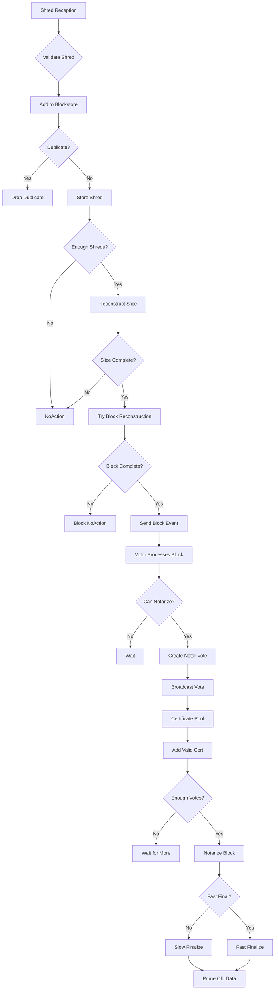

# Alpenglow Consensus Protocol: Debug Log Workflow Analysis

## Executive Summary

This report provides a comprehensive analysis of the Alpenglow proof-of-stake consensus protocol by tracing debug logs through the codebase. The logs from a 2-node local cluster reveal the complete consensus workflow from shred reception to finalization. Each log message is mapped to its source code location, with detailed explanations of the underlying mechanisms.

## Key Files and Their Roles

### Core Consensus Files

#### `src/consensus/blockstore/slot_block_data.rs`
**Purpose**: Manages block data storage and reconstruction for individual slots.
- **Key Functions**:
  - `add_validated_shred()`: Processes incoming shreds, handles duplicates, attempts reconstruction
  - `try_reconstruct_slice()`: Reconstructs data slices from shreds using erasure coding
  - `try_reconstruct_block()`: Assembles complete blocks from reconstructed slices

#### `src/consensus/block_producer.rs`
**Purpose**: Generates new blocks when timing conditions are met.
- **Key Functions**:
  - `produce_block_parent_ready()`: Creates blocks when parent is confirmed ready
  - `produce_block_parent_not_ready()`: Handles optimistic block production
  - Block production timing logic with delta_block and delta_first_slice parameters

#### `src/consensus/votor.rs`
**Purpose**: Handles voting logic for notarization and finalization.
- **Key Functions**:
  - `try_notar()`: Attempts to create notarization votes for valid blocks
  - `try_final()`: Creates finalization votes when conditions are met
  - Manages voting state and prevents double-voting

#### `src/consensus/pool.rs`
**Purpose**: Manages certificate pool and finalization state.
- **Key Functions**:
  - `add_valid_cert()`: Processes incoming certificates and triggers finalization
  - `handle_finalization()`: Updates finalization state and sends events
  - Coordinates between different finalization mechanisms (fast/slow)

#### `src/consensus/blockstore.rs`
**Purpose**: High-level blockstore interface and event routing.
- **Key Functions**:
  - `send_votor_event()`: Routes events to the voting system
  - Manages slot-specific block data storage

## Consensus Protocol Workflow



## Detailed Log Analysis

### 1. Shred Processing Phase

#### `DEBUG add_validated_shred: slot=308, slice_index=1, shred_index=59`
**Location**: `src/consensus/blockstore/slot_block_data.rs:191`
**Context**: Entry point for shred processing in `add_validated_shred()` function
```rust
debug!("add_validated_shred: slot={}, slice_index={}, shred_index={}", self.slot, slice_index, shred.payload().index_in_slice);
```
**What it does**: Logs when a validated shred is being added to the blockstore for a specific slot, slice, and shred index.

#### `DEBUG dropping duplicate shred 1-59 in slot 308`
**Location**: `src/consensus/blockstore/slot_block_data.rs:220`
**Context**: Duplicate detection logic in `add_validated_shred()`
```rust
if exists {
    debug!("dropping duplicate shred {}-{} in slot {}", slice_index, shred_index, self.slot);
    return Err(AddShredError::Duplicate);
}
```
**What it does**: Prevents redundant processing by dropping duplicate shreds that have already been stored.

#### `DEBUG add_validated_shred: NoAction for slice 0`
**Location**: `src/consensus/blockstore/slot_block_data.rs:237`
**Context**: Result of slice reconstruction attempt
```rust
ReconstructSliceResult::NoAction => {
    debug!("add_validated_shred: NoAction for slice {}", slice_index);
    Ok(None)
}
```
**What it does**: Indicates insufficient shreds collected yet for slice reconstruction.

### 2. Voting and Notarization Phase

#### `DEBUG try_notar: returning true, voted for slot 308`
**Location**: `src/consensus/votor.rs:305`
**Context**: Successful notarization vote creation
```rust
debug!("try_notar: returning true, voted for slot {}", slot);
```
**What it does**: Logs when the validator successfully creates and broadcasts a notarization vote for a block.

### 3. Block Production Phase

#### `DEBUG produced block 308 in 450 ms`
**Location**: `src/consensus/block_producer.rs:148`
**Context**: Block production timing measurement
```rust
debug!("produced block {} in {} ms", first_slot_in_window, start.elapsed().as_millis());
```
**What it does**: Measures and logs the time taken to produce a block, indicating performance.

#### `DEBUG produce_block_parent_ready: slot=309, parent_slot=308, parent_hash=2979d57f`
**Location**: `src/consensus/block_producer.rs:295`
**Context**: Block production with confirmed parent
```rust
debug!("produce_block_parent_ready: slot={}, parent_slot={}, parent_hash={}", slot, parent_block_id.0, &hex::encode(parent_block_id.1)[..8]);
```
**What it does**: Logs when producing a block with a parent that has been confirmed ready.

#### `INFO producing block in slot 309 with ready parent 2979d57f in slot 308`
**Location**: `src/consensus/block_producer.rs:299`
**Context**: High-level block production notification
```rust
info!("producing block in slot {} with ready parent {} in slot {}", slot, &hex::encode(parent_hash)[..8], parent_slot);
```
**What it does**: Announces block production with parent block information.

### 4. Certificate Processing Phase

#### `DEBUG add_valid_cert: cert=NotarFallback(NotarFallbackCert {...})`
**Location**: `src/consensus/pool.rs:137`
**Context**: Certificate addition to pool
```rust
debug!("add_valid_cert: cert={:?}", cert);
```
**What it does**: Logs when a certificate (vote) is added to the certificate pool for processing.

#### `INFO notarized(-fallback) block 2979d57f in slot 308`
**Location**: `src/consensus/pool.rs:149`
**Context**: Block notarization confirmation
```rust
info!("notarized(-fallback) block {} in slot {}", &hex::encode(block_hash)[..8], slot);
```
**What it does**: Announces that a block has been notarized with sufficient votes.

#### `INFO fast finalized slot 308`
**Location**: `src/consensus/pool.rs:190`
**Context**: Fast finalization achievement
```rust
info!("fast finalized slot {slot}");
```
**What it does**: Indicates probabilistic finality achieved through fast finalization votes.

#### `INFO slow finalized slot 308`
**Location**: `src/consensus/pool.rs:197`
**Context**: Absolute finalization achievement
```rust
info!("slow finalized slot {slot}");
```
**What it does**: Indicates absolute finality achieved through slow finalization votes.

### 5. Event Routing Phase

#### `DEBUG send_votor_event: event=FirstShred(Slot(309))`
**Location**: `src/consensus/blockstore.rs:107`
**Context**: Event routing to voting system
```rust
debug!("send_votor_event: event={:?}", event);
```
**What it does**: Logs when events are sent to the voting system, such as the first shred arrival.

## Protocol State Machine

The logs reveal a clear state progression:

1. **Shred Collection**: Nodes receive and validate shreds from the network
2. **Block Reconstruction**: Sufficient shreds trigger block assembly
3. **Notarization**: Validators vote on valid blocks
4. **Fast Finalization**: Quick probabilistic finality
5. **Slow Finalization**: Absolute finality with additional confirmation

## Performance Insights

- **Block Production Time**: 450ms for slot 308 indicates healthy performance
- **Shred Processing**: High duplicate rate suggests robust data dissemination
- **Finalization Speed**: Fast finalization occurs quickly after notarization

## Code Architecture Insights

### Modular Design
- **Blockstore**: Pure data management and reconstruction
- **Block Producer**: Timing and block creation logic
- **Votor**: Voting and consensus logic
- **Pool**: Certificate aggregation and finalization

### Async Processing
- Extensive use of async/await for network operations
- Channel-based communication between components
- Non-blocking event processing

### Error Handling
- Comprehensive error types (AddShredError, etc.)
- Graceful handling of invalid/duplicates
- Logging at appropriate levels (debug/info/warn)

## Conclusion

The debug logs provide a complete trace of the Alpenglow consensus protocol execution, from individual shred processing to final block finalization. The modular architecture ensures clean separation of concerns while maintaining high performance. The extensive logging enables detailed debugging and performance monitoring of the distributed consensus system.

Key takeaways:
- Robust duplicate handling prevents redundant processing
- Multi-stage finality provides both speed and security
- Async architecture supports high-throughput consensus
- Comprehensive logging enables deep operational insights