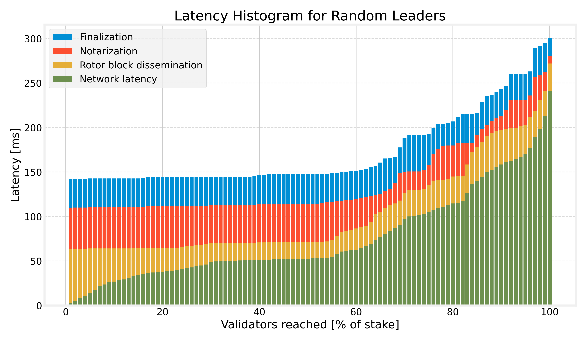

# Alpenglow

Research reference implementation of the Alpenglow consensus protocol.



## Getting Started

A local cluster example can be run with the following command:

```bash
./run.sh
```

This spawns a local cluster with 6 nodes.
These nodes communicate via UDP on localhost.
Console output from the [`fastrace`](https://docs.rs/fastrace) crate shows the progress of all nodes.

Further, we provide the `simulations` binary target.
It provides various simulations of parts of the Alpenglow protocol,
specifically resilience of Rotor, as well as latency and bandwidth requirements of Alpenglow as a whole.
Currently, configuration is a bit cumbersome and is done via the `const` values in `src/bin/simulations/main.rs`.

Some of the simulations, specifically the latency simulation, requires first downloading a public ping dataset via this script:

```bash
./download_data.sh
```

After that, the simulations can be run like this:

```bash
RUST_LOG="simulations=debug" cargo run --release --bin=simulations
```

## Benchmarks

Some micro-benchmarks can be run like this:

```bash
cargo bench
```

## Tests

Regular tests can be run like this:

```bash
./test.sh
```

The more extensive test suite, including some slow tests, can be run like this:

```bash
./test.sh slow
```

## Security

For security related issues, please do not file a public issue on GitHub,
instead reach out directly via email to:

quentin (at) anza (dot) xyz

## License

Copyright (c) Anza Technology, Inc.

Licensed under the Apache License, Version 2.0. See [LICENSE](LICENSE) for details.

## Literature

- [Alpenglow Whitepaper](https://drive.google.com/file/d/1y_7ddr8oNOknTQYHzXeeMD2ProQ0WjMs/view?usp=sharing)
- [Anza Blog Post](https://www.anza.xyz/blog/alpenglow-a-new-consensus-for-solana)
